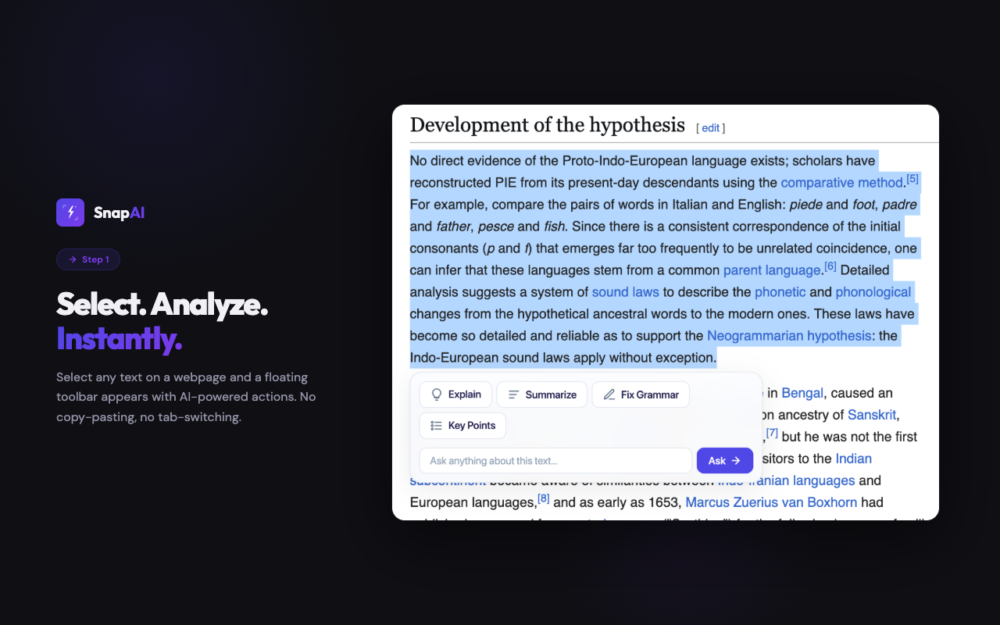
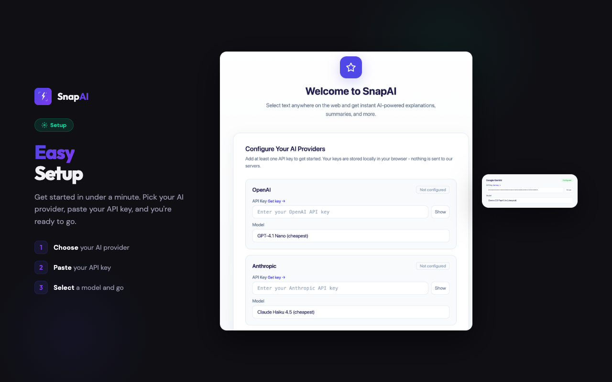

<p align="center">
  
</p>

<h1 align="center">SnapAI</h1>

<p align="center">
  <strong>Select any text on the web. Get instant AI-powered insights.</strong>
</p>

<p align="center">
  <a href="#features">Features</a> •
  <a href="#installation">Installation</a> •
  <a href="#setup">Setup</a> •
  <a href="#supported-providers">Providers</a> •
  <a href="#privacy">Privacy</a> •
  <a href="#contributing">Contributing</a>
</p>

<p align="center">
  
</p>

---

## Features

- **Floating Toolbar** — Select any text on a webpage and a toolbar appears with AI actions
- **Explain** — Get clear, concise explanations of complex text
- **Summarize** — Condense long passages into quick summaries
- **Fix Grammar** — Correct spelling and grammar issues instantly
- **Key Points** — Extract the main ideas as a bullet list
- **Side Panel** — Full conversation view with follow-up questions
- **Markdown Rendering** — Responses render with proper formatting and syntax highlighting
- **Multi-Provider** — Bring your own API key from OpenAI, Anthropic, Gemini, or DeepSeek
- **Privacy First** — No servers, no analytics, no tracking. Everything stays local.

## Installation

### Chrome Web Store

Install SnapAI from the [Chrome Web Store](https://chrome.google.com/webstore) (link coming soon).

### Manual Installation (Developer Mode)

1. Clone this repository:
   ```bash
   git clone https://github.com/Hammad-7/Snap-AI-extension.git
   ```
2. Open Chrome and navigate to `chrome://extensions`
3. Enable **Developer mode** (toggle in the top-right corner)
4. Click **Load unpacked** and select the cloned folder
5. SnapAI will appear in your extensions bar

## Setup

1. Click the SnapAI icon in your toolbar or open the onboarding page
2. Choose your AI provider (OpenAI, Anthropic, Gemini, or DeepSeek)
3. Paste your API key
4. Select a model
5. Start selecting text on any webpage

<p align="center">
  
</p>

## Supported Providers

| Provider | Models | Get API Key |
|----------|--------|-------------|
| **OpenAI** | GPT-4.1 Nano, GPT-4.1 Mini, GPT-4.1, GPT-4o Mini, GPT-4o, o3-mini, o4-mini | [platform.openai.com](https://platform.openai.com/api-keys) |
| **Anthropic** | Claude Haiku 4.5, Claude Sonnet 4.5, Claude Sonnet 4.6, Claude Opus 4.6 | [console.anthropic.com](https://console.anthropic.com/settings/keys) |
| **Google Gemini** | Gemini 2.5 Flash Lite, Gemini 2.5 Flash, Gemini 2.5 Pro, Gemini 3 Flash, Gemini 3 Pro | [aistudio.google.com](https://aistudio.google.com/apikey) |
| **DeepSeek** | DeepSeek Chat, DeepSeek Reasoner | [platform.deepseek.com](https://platform.deepseek.com/api_keys) |

## How It Works

```
  Select Text → Floating Toolbar → Choose Action → AI Response
                                                      ↓
                                              Inline card or
                                              Side Panel view
```

1. **Select text** on any webpage
2. A **floating toolbar** appears with 4 actions
3. Click an action — the request goes directly from your browser to your chosen AI provider
4. The response appears in a **floating card** below the text, or in the **side panel** for a full conversation

## Project Structure

```
snapai-extension/
├── manifest.json          # Extension manifest (MV3)
├── privacy-policy.html    # Privacy policy page
├── README.md
├── LICENSE                # MIT License
├── CONTRIBUTING.md
├── background/
│   └── service-worker.js  # Background service worker
├── content/
│   ├── content.js         # Floating toolbar + inline responses
│   └── content.css        # Content script styles
├── sidepanel/
│   ├── sidepanel.html     # Side panel UI
│   ├── sidepanel.js       # Side panel logic
│   └── sidepanel.css      # Side panel styles
├── popup/
│   ├── popup.html         # Popup UI
│   ├── popup.js           # Popup logic
│   └── popup.css          # Popup styles
├── onboarding/
│   ├── onboarding.html    # Setup / options page
│   ├── onboarding.js      # Onboarding logic
│   └── onboarding.css     # Onboarding styles
├── shared/
│   ├── constants.js       # Actions, message types
│   ├── providers.js       # AI provider configs
│   ├── storage.js         # chrome.storage helpers
│   └── markdown.js        # Markdown renderer
├── icons/                 # Extension icons (16, 32, 48, 128)
│   └── brands/            # Provider brand icons
└── chrome-publish/        # Chrome Web Store assets
```

## Privacy

**SnapAI does not collect, store, or transmit any data to us.** There are no SnapAI servers.

- API keys are stored locally via `chrome.storage.local`
- Selected text is sent only to the AI provider you configure
- No analytics, tracking, cookies, or third-party scripts
- Uninstalling removes all stored data

Read the full [Privacy Policy](privacy-policy.html).

## Permissions

| Permission | Why |
|------------|-----|
| `storage` | Save your API keys and preferences locally |
| `sidePanel` | Open the conversation side panel |
| Host permissions | Send requests to AI provider APIs (OpenAI, Anthropic, Gemini, DeepSeek) |

## Contributing

Contributions are welcome! Please see [CONTRIBUTING.md](CONTRIBUTING.md) for guidelines.

## License

This project is licensed under the MIT License. See [LICENSE](LICENSE) for details.
